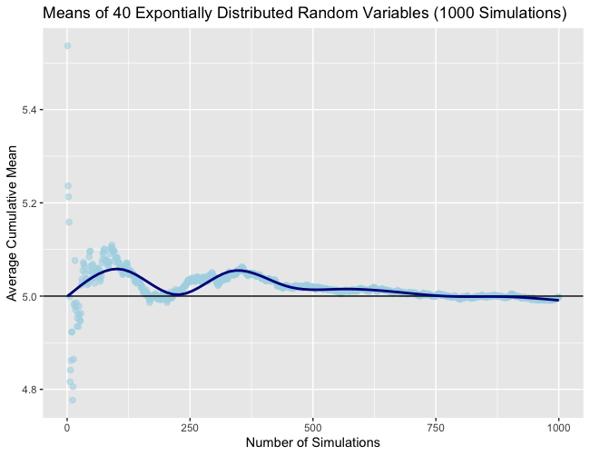
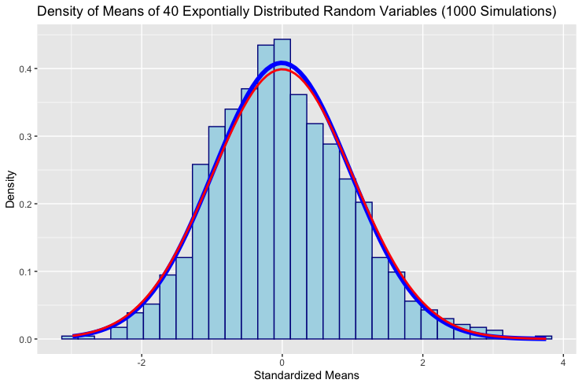

# Exploring-CLT-With-Exp-Random-Variables

This is a simulation to illustrate the Central Limit Theorem (CLT) using exponential random variables.  The CLT states that the distribution of averages (once properly normalized) becomes that of a standard normal distribution as the sample size increases.  To demonstrate this, a histogram was made of the averages from each experiment containing 40 random variables from the exponential distribution.

As can be seen, the histogram representing our experimental data appears to be normally distributed.  The blue line is the normal density function centered at average of means from each experiment with the standard deviation from the means from each experiment.  The red line is the standard normal density function.  These two lines nearly perfectly overlap each other, showing that the means from our experimental data are normally distributed.  Because of CLT, for a sufficiently large number of simulations these two lines would perfectly overlap.